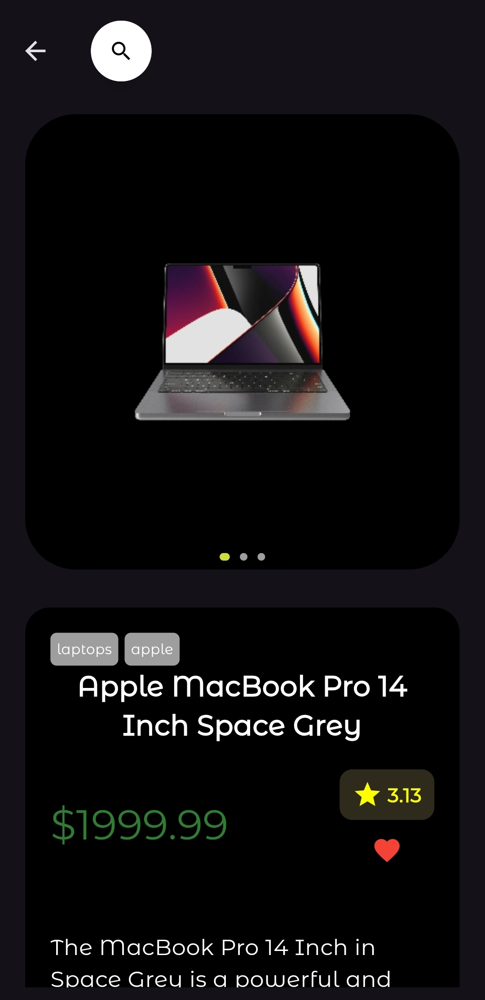
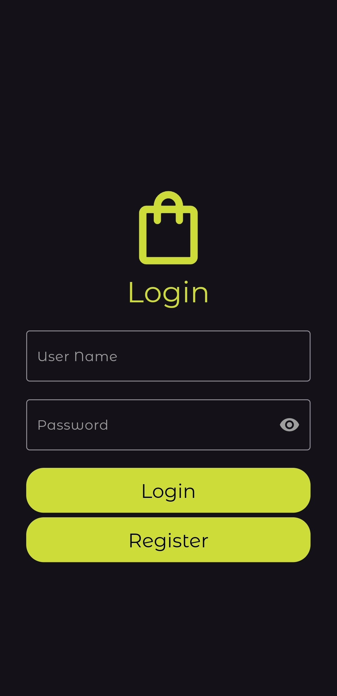
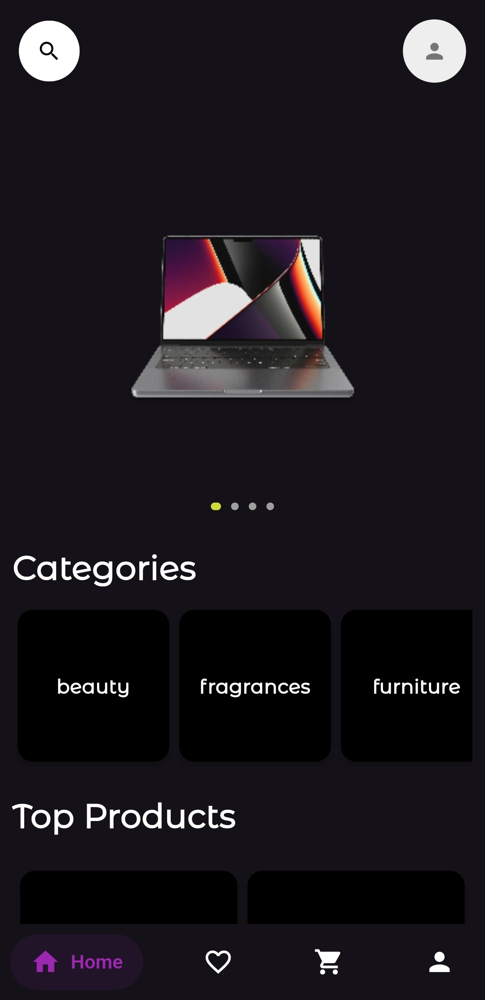

# E-Commerce_mobile -     
## Descrição

Este é um projeto de loja virtual desenvolvido com o objetivo de praticar e aprimorar 
habilidades no uso do Flutter, um framework de desenvolvimento de aplicativos móveis. 
A aplicação simula uma experiência de uma loja online, oferecendo recursos como login e registo, navegação entre categorias de produtos, visualização detalhada de itens, carrinho de compras, área de favoritos, área para pesquisa dos produtos com opção para filtrar os produtos, página com perfil do usuário, com seu endereço e método de pagamento.

### Capturas de Tela
<div style="display: flex;">
  
  
  
</div>

## Instruções de uso no Android
1.Baixe o APK:
  - Acesse a seção de releases do projeto no GitHub.
  - Faça o download do arquivo APK mais recente disponível.
    
2.Permissão para Instalação por Fontes Externas:
  - Antes de instalar o APK, certifique-se de permitir a instalação de aplicativos de fontes externas. Para isso:
    1. Vá para as configurações do seu dispositivo Android.
    2. Acesse a seção de segurança ou privacidade.
    3. Ative a opção "Fontes desconhecidas" ou "Instalação de apps de fontes desconhecidas".
    
3.Instalação do Aplicativo:
  - Após permitir a instalação por fontes externas, navegue até o local onde o APK foi baixado.
  - Toque no arquivo APK para iniciar o processo de instalação.
  - Siga as instruções na tela para concluir a instalação do aplicativo.
    
4.Abrindo o Aplicativo:
  - Após a instalação ser concluída com sucesso, localize o ícone do aplicativo na tela inicial ou no menu de aplicativos do seu dispositivo.  
  - Toque no ícone para abrir o aplicativo.

## API
O app faz uso da API [dummyjson](http://dummyjson.com/)

## Instruções de instalação
1. Clone o repositório do projeto em sua máquina local.
2. Navegue até a raiz do projeto
3. No terminal, execute o comando abaixo para instalar as dependências do projeto.
```bash
   flutter pub get
   ```
4. Abra o Android Studio ou Visual Studio Code e importe o projeto Flutter.
5. Certifique-se de ter um dispositivo físico conectado via USB ou um emulador Android configurado no Android Studio.
6. No Android Studio, selecione o dispositivo desejado ou inicie o emulador Android.
7. No terminal, execute o comando abaixo para iniciar a aplicação no dispositivo/emulador
```bash
   flutter run
   ```

## Tecnologias usadas
- Flutter
- Dart

